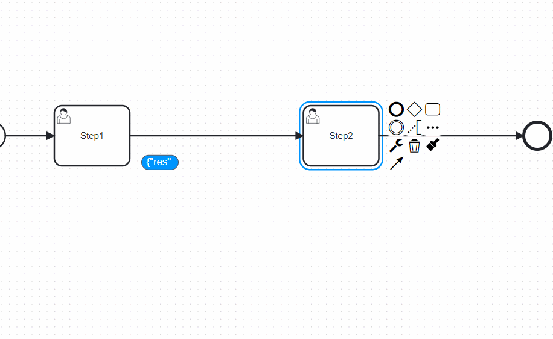

# Camunda Modeler Plugin View Inputs and Outputs

 [-orange.svg>)](#)

## Description

This plugin will allow you to see what data is being passed along the flow.

## How to use

The information about which data will be passed along the flow is taken from the **Example data** field of the source task. In the closed state, only a small part of this information will be displayed in the badge. To see it in full, click on the badge to open a panel where you can view the complete information.

## How to install

- Pull this repository and copy into the `plugins` folder of the Camunda Modeler
- Start the Camunda Modeler
